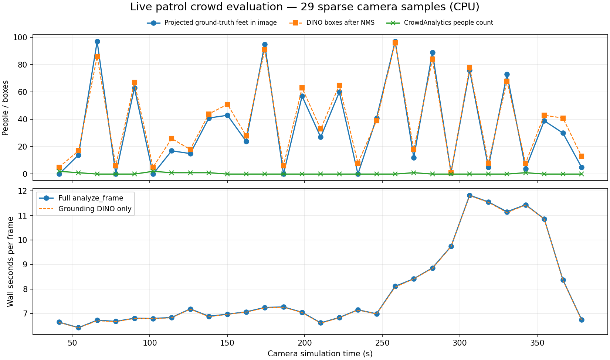

# Phase 3a: live crowd analytics evaluation

Run `20261007_151453_crowd`. Full logs/images: `/home/aryam/aware_test_logs/20261007_151453_crowd`. **29 live frames** at 1280 × 960, spanning sim 41.452–378.580 s. The target was about 30; 29 synchronized frames were collected before the patrol landed. Fresh telemetry stopped at landing; subsequent images were excluded as stale, and the evaluator was interrupted gracefully. Its exit code 1 indicates fewer than the requested exact 30, not a model exception. No dashboard/backend/search worker ran, and no GPT calls were made. Scenario `missing_person --scale 0.5` (125 scripted people); patrol `--start auto --loops 4`.

## Result

**The current crowd count is unsuitable for these sparse CPU patrol snapshots.** Average count was 0.34, versus 35.34 projected people in view. Grounding DINO found many boxes, but ByteTrack often returned no confirmed tracks after the view changed. This is a counter/tracking integration problem in addition to detector errors.

| Measurement | Result |
|---|---:|
| Full analyze_frame mean / median | 7.978 / 7.071 s |
| Full analyze_frame minimum / maximum / p95 | 6.427 / 11.826 / 11.507 s |
| DINO-only mean | 7.963 s |
| Model load, measured separately | 3.415 s |
| Effective processing throughput | 0.125 frames/s |
| Crowd count mean signed error | -35.00 people |
| Crowd count mean absolute error / RMSE | 35.28 / 48.19 people |
| NMS box count mean absolute error / signed error | 5.07 / 3.14 boxes |
| Zero crowd count when projected reference >0 | 18/24 nonempty frames |

## How the reference was measured

The scorer subscribed to the **full** `/aware/ground_truth` topic, not just the missing person. It interpolated each actor’s lat/lon between reference samples at the image header timestamp. Drone telemetry was interpolated at that time, including roll, pitch and wrapped heading; camera_info supplied fx/fy/cx/cy. The camera right/down/forward basis was derived from `aware_geo.pixel_to_ground` rays, then inverted to project actor ground positions into the image. Points were counted only in front of the camera, inside the 1280 × 960 rectangle and inside the configured 0.1–80 m optical-depth clipping range. Ground truth was never supplied to the detector or tracker.

This is the requested **projected in-view reference**, not a perfect visibility mask: it does not remove people hidden behind booths, other people or drone arms. It uses foot/ground points, so partly visible people with feet outside the image can be missed. `aware_geo` ignores the 0.10 m camera mount offset. Patrol telemetry lacks a simulation timestamp, so samples were associated with the most recent `/clock` at receipt; gaps over 0.5 sim seconds were rejected. Reference gaps over 1.5 s were rejected. Actor scripts and rounded ground-truth coordinates also limit pixel accuracy. Projection overlays are saved for all samples.

## Why counts fail

`analyze_frame` returns a people count from current logical IDs produced by ByteTrack, not the number of detector boxes. Sparse samples and fast camera movement create unmatched, unconfirmed new tracks. The constructor assumes tracker_frame_rate=5, stale-track memory=2 s and ID-switch recovery=1 s, while this evaluation samples at least 12 simulation seconds apart. This is a baseline of the existing class at the requested sampling cadence, not a 5 Hz tracking benchmark. CPU inference is too slow for that nominal cadence here.

On frame 3, DINO produced 108 proposals and 86 NMS boxes; the projected reference was 97, but analytics reported zero. A synthetic test with two detections in every frame reproduced counts 2 → 0 → 2 after a large view change. On frame 1, the reference was zero and analytics counted two: the annotated boxes visibly covered the drone arms. NMS counts are much closer overall, but include low-confidence false positives and duplicates; their count ratio is not detector recall.

## Can the search model be reused?

**Yes, with a small future injection change; currently it is loaded twice if both classes are constructed normally.** Both use `GroundingDinoHuggingfaceWrapper`, `IDEA-Research/grounding-dino-tiny`, box threshold 0.1 and text threshold 0.05. The search detector is available as `controller.pipeline.backend.detector`. CrowdAnalytics unconditionally constructs a new wrapper at the top of its constructor; it has no detector parameter.

The evaluation’s test-only factory substitution gave two independent CrowdAnalytics/ByteTrack instances the same detector. Model and processor object identities matched; the same frame produced identical NMS boxes and counts (2 each), with no second weight load. This demonstrates injection feasibility without changing production constructors or loading SearchController/GPT. A normal implementation would add an optional `detector` argument to CrowdAnalytics and pass the already-loaded search detector.

Sharing weights saves a second model allocation, but does not save two inference passes automatically. Coordinate calls through one inference owner/lock. For the same camera frame and compatible resize/prompt settings, share unfiltered person detections before search colour/rejection/GPT filtering; crowd needs all people and its own independent tracking state. Do not share ByteTrack state between search and crowd.

## Per-frame results

| # | Camera sim s | Full seconds | Crowd count | Projected reference | NMS boxes | Error |
|---|---:|---:|---:|---:|---:|---:|
| 1 | 41.452 | 6.652 | 2 | 0 | 5 | +2 |
| 2 | 54.056 | 6.427 | 1 | 14 | 17 | -13 |
| 3 | 66.068 | 6.730 | 0 | 97 | 86 | -97 |
| 4 | 78.080 | 6.684 | 0 | 0 | 6 | +0 |
| 5 | 90.092 | 6.811 | 0 | 63 | 67 | -63 |
| 6 | 102.104 | 6.802 | 2 | 0 | 5 | +2 |
| 7 | 114.116 | 6.841 | 1 | 17 | 26 | -16 |
| 8 | 126.128 | 7.193 | 1 | 15 | 18 | -14 |
| 9 | 138.140 | 6.891 | 1 | 41 | 44 | -40 |
| 10 | 150.152 | 6.977 | 0 | 43 | 51 | -43 |
| 11 | 162.164 | 7.071 | 0 | 24 | 28 | -24 |
| 12 | 174.176 | 7.250 | 0 | 95 | 91 | -95 |
| 13 | 186.256 | 7.272 | 0 | 0 | 6 | +0 |
| 14 | 198.268 | 7.054 | 0 | 57 | 63 | -57 |
| 15 | 210.280 | 6.623 | 0 | 27 | 33 | -27 |
| 16 | 222.292 | 6.841 | 0 | 60 | 65 | -60 |
| 17 | 234.304 | 7.155 | 0 | 0 | 8 | +0 |
| 18 | 246.316 | 6.992 | 0 | 41 | 39 | -41 |
| 19 | 258.328 | 8.112 | 0 | 97 | 96 | -97 |
| 20 | 270.340 | 8.422 | 1 | 12 | 18 | -11 |
| 21 | 282.352 | 8.861 | 0 | 89 | 84 | -89 |
| 22 | 294.364 | 9.738 | 0 | 1 | 1 | -1 |
| 23 | 306.376 | 11.826 | 0 | 76 | 78 | -76 |
| 24 | 318.452 | 11.553 | 0 | 5 | 8 | -5 |
| 25 | 330.464 | 11.152 | 0 | 73 | 68 | -73 |
| 26 | 342.476 | 11.438 | 1 | 4 | 8 | -3 |
| 27 | 354.488 | 10.861 | 0 | 39 | 43 | -39 |
| 28 | 366.568 | 8.372 | 0 | 30 | 41 | -30 |
| 29 | 378.580 | 6.754 | 0 | 5 | 13 | -5 |

[CSV results](CROWD_LIVE_FRAMES.csv). Raw per-frame projections, images and timings are in frames.jsonl and the run directory. Timing excludes ROS waiting, scoring, JPEG output and the one-off shared-model probe.

## Checks, cleanup and scope

Three synthetic projection tests and the ByteTrack sampling diagnostic passed; the ai_venv pipeline_runner import check passed. Camera publishing was checked before inference. The standard aware_stop implementation and process-group cleanup stopped the simulation and evaluator. See aware_stop.log/processes_after.log. ByteTrack emitted its existing deprecation warning; PX4 emitted its simulated LED warning, and ground truth may log its shutdown exception during cleanup.

Only evaluation tools, tests and this report/CSV/plot were added. CrowdAnalytics, the detector, dashboard and backend production code were not changed. The main next analytics change would be to define snapshot counts from current person detections independently of persistent-track confirmation, then evaluate false positives and occlusion separately.
