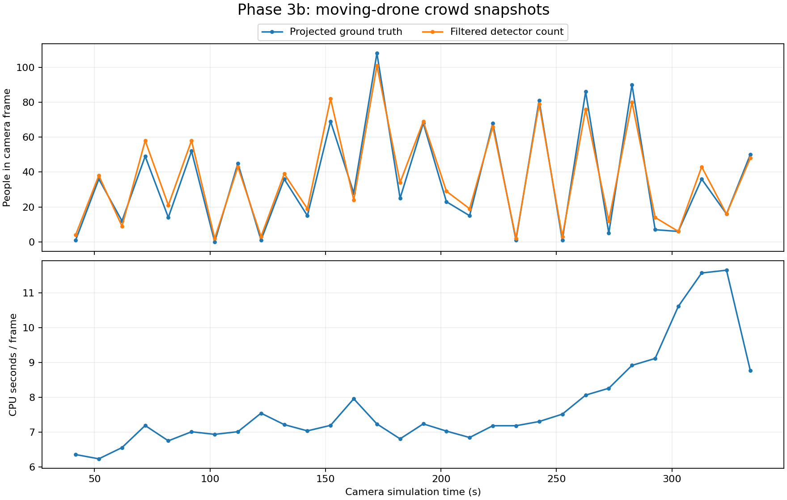

# Phase 3b: moving-drone crowd counting

Run `20261007_153921_crowd_moving`: **30 live 1280 × 960 frames**, sim 41.848–333.896 s, sampled at least 10 sim seconds apart during `missing_person --scale 0.5`, patrol `--start auto --loops 4` (125 actors). Logs, camera images, detection overlays, projection overlays and synchronized references: `/home/aryam/aware_test_logs/20261007_153921_crowd_moving`. No dashboard/backend/search worker or GPT ran in this benchmark. Ground truth was scoring-only.

## Result

The new counter follows people detections as the drone moves instead of dropping new, unconfirmed ByteTrack IDs. Average count **36.57**, projected reference **34.80**. Total-count mean absolute error **4.57 people**, signed error **+1.77**, RMSE **5.65**. These are count errors, not precision/recall.

| Measurement | Result |
|---|---:|
| Detection + counting mean / median | 7.747 / 7.210 s |
| Minimum / maximum / p95 | 6.239 / 11.651 / 11.140 s |
| Detector call mean (including image cache key) | 7.737 s |
| NMS, plausibility, ground/zone projection + coverage mean | 5.22 ms |
| Model load, excluded from frame timings | 5.649 s |
| Effective processing throughput | 0.129 frames/s |
| Actual DINO inference calls | 30 |
| Zero measured count on a nonempty reference | 0/29 frames |
| Nonzero measured count on an empty reference | 1/1 frames |

Phase 3a reported MAE 35.28 and mean count 0.34 with the old ByteTrack-based counter. This run uses a different patrol/view sequence and 10 s rather than 12 s sampling; it is not a controlled same-image before/after comparison. The synthetic moving-view test establishes that the new counter does not wait for track confirmation.

## Per-zone results

Reference counts include only actors whose ground/foot point projects inside this frame and lies in that YAML zone. They do not use the full-venue zone_counts topic. The table uses only frames with nonzero sampled zone coverage, avoiding dilution by unseen zero-count zones. The CSV includes every frame/zone, including unseen ones.

| Zone | Frames seen | Mean count | Mean projected reference | MAE | Signed error | Frames allowing occupancy |
|---|---:|---:|---:|---:|---:|---:|
| entrance | 8 | 2.75 | 1.75 | 1.25 | +1.00 | 3 |
| walkway | 14 | 7.50 | 7.21 | 2.00 | +0.29 | 5 |
| plaza | 17 | 17.82 | 16.94 | 2.41 | +0.88 | 4 |
| booth_a_front | 11 | 7.09 | 7.00 | 1.91 | +0.09 | 7 |
| booth_b_front | 13 | 8.62 | 8.46 | 2.77 | +0.15 | 10 |
| booth_c_front | 9 | 7.44 | 6.11 | 2.22 | +1.33 | 8 |
| booth_d_front | 13 | 6.23 | 5.08 | 2.08 | +1.15 | 10 |

Visible counts describe the current view, not a remembered whole-zone population. Occupancy is `visible_count / capacity × 100`, emitted only when sampled coverage is at least 0.8; otherwise it is null. Counts are not extrapolated to fill unseen areas. Last_seen advances only when coverage is positive, and retains its prior sim timestamp when the zone leaves view. Missing/invalid pose makes zone count and coverage unknown rather than zero.

## Geometry and coverage

`analytics/moving_crowd.py` applies the existing IoU 0.4 NMS followed by `aware_candidates.plausible`, then counts the remaining boxes directly. It has no tracker, footfall or dwell. Each box bottom-centre is projected with `aware_geo.box_to_ground` including body roll/pitch. Latitude/longitude are converted to YAML world ENU metres using the venue origin and the same local WGS84 approximation as simulation patrol_plan; x is east and y north. Polygon assignment follows YAML order if zones overlap.

Coverage uses a fixed 0.5 m grid of cell-centre ground points inside each polygon. `aware_geo.camera_basis/ground_to_pixel` supply the inverse body-fixed projection. Points must be in front, within the image and within the camera's 0.1–80 m optical-depth clipping range. It is an area approximation of geometric view, not an occlusion mask. A 0.25 m grid check on the same poses differed by mean **0.069 percentage points**, maximum **1.823 points**; **0** frame/zone pairs changed sides of the 80% threshold. See coverage_resolution_check.json.

The scorer interpolates actor lat/lon and drone pose at each camera header stamp; camera_info supplies intrinsics. Pose includes roll, pitch and wrapped heading. As in Phase 3a, patrol telemetry has no sim timestamp: receive-time /clock association and interpolation gaps ≤0.5 sim seconds are used. Reference gaps >1.5 s are rejected. The scorer projects ground-truth feet through the inverse aware_geo geometry, then checks the camera frustum and zone polygons. Ground truth is never an input to DINO or production counting.

The reference includes geometrically projected people hidden by booths, other people or drone arms. Partly visible people whose feet are outside the image can be excluded by the reference but detected by DINO. Conversely clipped detection boxes can project their bottom edge to the wrong ground position. False positives, duplicate nested boxes, missed/occluded people and foot localization errors remain; no new heuristic was tuned to this run. The flat-floor model ignores the 0.10 m camera mount offset.

## Sharing search inference

`analytics/shared_detector.py` wraps the injected detector with one lock and a bounded two-image raw-detection cache keyed by exact image content, dimensions/mode, person prompt and thresholds. It shares weights and raw boxes/scores, not search colour filtering, GPT answers, rejected places or track IDs. Returned arrays are copies because search expands candidate boxes. Calls are serialized, including different images; matching frames avoid a second model pass.

`DetectorVlmPipeline` owns this shared wrapper. `MovingCrowdCounter(detector=controller.pipeline.backend.detector)` reuses it without loading another model. Optional `pipeline_runner.run_on_video(..., on_crowd_analysis=callback)` counts after search: same-frame person inference is reused; local-tracking-only frames need one crowd detector call. This extra CPU work is opt-in and the dashboard/backend do not enable it. Category/prompt, thresholds and image must match for reuse; intentionally different detector prompts are not cached as equivalent.

The live first-frame probe used two independent counters sharing the same model: identical boxes/counts (4), **1 actual inference call**, **1 cache hit**, and **5.83 ms** for the second consumer. A synthetic integration test exercises the real DetectorVlmPipeline-to-counter reuse; a concurrent test verifies only one inference runs at once. This benchmark did not launch GPT search, so it is not a live simultaneous search-throughput benchmark.

## Per-frame counts

| # | Camera sim s | Count | Projected reference | Error | Processing s |
|---|---:|---:|---:|---:|---:|
| 1 | 41.848 | 4 | 1 | +3 | 6.362 |
| 2 | 51.880 | 38 | 36 | +2 | 6.239 |
| 3 | 61.912 | 9 | 12 | -3 | 6.561 |
| 4 | 71.944 | 58 | 49 | +9 | 7.195 |
| 5 | 81.976 | 21 | 14 | +7 | 6.755 |
| 6 | 92.008 | 58 | 52 | +6 | 7.015 |
| 7 | 102.040 | 2 | 0 | +2 | 6.941 |
| 8 | 112.072 | 43 | 45 | -2 | 7.017 |
| 9 | 122.104 | 3 | 1 | +2 | 7.549 |
| 10 | 132.136 | 39 | 36 | +3 | 7.221 |
| 11 | 142.168 | 19 | 15 | +4 | 7.041 |
| 12 | 152.200 | 82 | 69 | +13 | 7.199 |
| 13 | 162.232 | 24 | 28 | -4 | 7.961 |
| 14 | 172.264 | 101 | 108 | -7 | 7.240 |
| 15 | 182.296 | 34 | 25 | +9 | 6.812 |
| 16 | 192.328 | 69 | 68 | +1 | 7.241 |
| 17 | 202.360 | 29 | 23 | +6 | 7.035 |
| 18 | 212.392 | 19 | 15 | +4 | 6.850 |
| 19 | 222.424 | 66 | 68 | -2 | 7.188 |
| 20 | 232.456 | 2 | 1 | +1 | 7.188 |
| 21 | 242.488 | 79 | 81 | -2 | 7.309 |
| 22 | 252.520 | 3 | 1 | +2 | 7.521 |
| 23 | 262.616 | 76 | 86 | -10 | 8.067 |
| 24 | 272.648 | 12 | 5 | +7 | 8.264 |
| 25 | 282.680 | 80 | 90 | -10 | 8.920 |
| 26 | 292.712 | 14 | 7 | +7 | 9.119 |
| 27 | 302.744 | 6 | 6 | +0 | 10.613 |
| 28 | 312.844 | 43 | 36 | +7 | 11.571 |
| 29 | 323.600 | 16 | 16 | +0 | 11.651 |
| 30 | 333.896 | 48 | 50 | -2 | 8.773 |

[Frame CSV](CROWD_MOVING_FRAMES.csv) · [Zone CSV](CROWD_MOVING_ZONES.csv). Raw detections, zone coverage, occupancy, last_seen, references and errors are in frames.jsonl. Timings exclude ROS waiting, reference interpolation/scoring, image output and the one-off reuse/resolution probes.

## Validation and cleanup

28 Python tests passed (new counting/coverage/sharing tests plus geometry, quota, item 10 and dashboard regressions); the existing Node dashboard UI check and ai_venv pipeline_runner import check passed. The camera was confirmed publishing before inference. The evaluator completed its requested 30 frames with exit 0, then the standard aware_stop implementation and process-group cleanup stopped the launched simulation components. Read camera_hz.log, crowd_evaluation.log, patrol.log, aware_stop.log and processes_after.log for the actual run. No inference or scoring errors occurred. Ground truth emitted its existing rclpy ExternalShutdownException during aware_stop. PX4 logged preflight heading/GCS warnings before successfully arming and flying the patrol.

Changed production files: new analytics/moving_crowd.py and shared_detector.py, inverse projection helpers in aware_geo.py, detector wrapping in DetectorVlmPipeline, optional crowd callback in pipeline_runner.py. Added test_moving_crowd.py, tools/evaluate_moving_crowd_live.py and this report/CSV/plot. Dashboard/backend files were not edited in Phase 3b. The old CrowdAnalytics tracking/footfall demo remains available; the new moving-camera path does not use it.

The most useful next improvement is to reduce duplicate/partial-person detections and verify foot positions near image edges before treating per-zone counts as reliable occupancy. CPU detection remains the main speed limit; sharing inference removes duplicate work but cannot make a single pass real-time.
