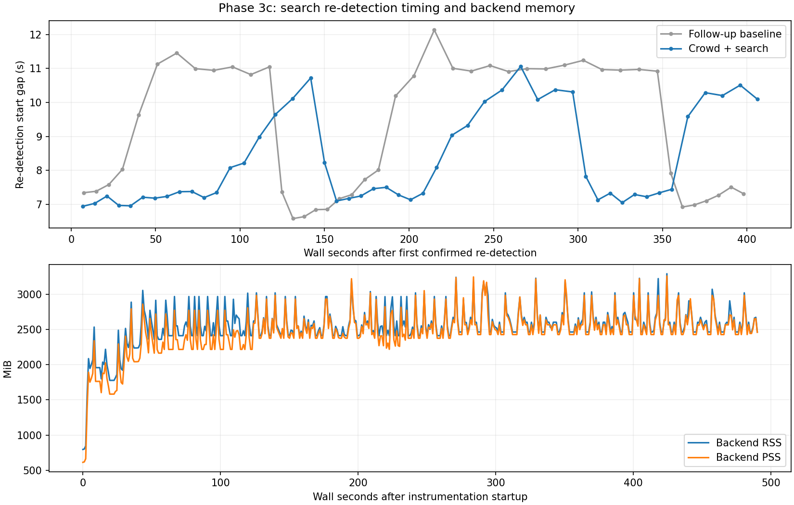
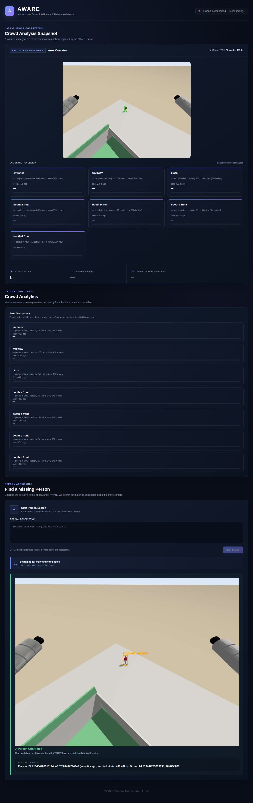

# Phase 3c: live crowd and missing-person dashboard

Run `20261007_160638_dashboard_crowd`; complete logs/images: `/home/aryam/aware_test_logs/20261007_160638_dashboard_crowd`. Eight-minute real WebSocket test, including 25 seconds observing crowd updates before starting search. Scenario `missing_person --scale 0.5`, patrol `--start auto --loops 4`. The client rejects the first candidate about 3 wall seconds after arrival, confirms the next, then watches ongoing tracking. Ground truth was subscribed only by the scoring client, never by the backend or either inference path.

**Test passed:** 226 validated messages; {"search_status": 8, "error": 1, "crowd_analytics": 56, "crowd_snapshot": 56, "candidate": 2, "tracking_update": 53, "rejected": 1, "person_location": 49}. Errors: []. The single error message was the intentional unknown-command validation probe, which left the socket usable. Missing-person flow validated candidate identities, actual reject/confirm acknowledgements, confirmed previews and verified person/drone positions. Crowd checks validated all seven zones, capacity, coverage, occupancy/crowded gating, observation timestamps, JPEG decoding and ≤640 px snapshots paired with every analytics timestamp.

## What changed

The backend loads Grounding DINO once at startup and owns CrowdService. SearchController/get_vlm_pipeline/run_on_video now accept that detector rather than loading another. SharedDetector serializes all calls and offers a nonblocking low-priority path plus exact-frame raw detection lookup. Idle crowd runs nominally every 10 wall seconds using the latest camera frame. Starting search pauses idle inference; an already-running CPU pass finishes, but no new idle pass queues ahead of search.

During search, the post-frame observer counts from search's raw full-frame person detections, after candidate/confirm/reject acknowledgements and patrol target publication. Tracking-only crowd inference is limited to once per 15 wall seconds and only when its measured execution budget fits before the next re-detection. Forced/due search checks and frames about to resume searching take priority. This CPU's DINO passes exceed the normal 3 s check interval, so extra tracking inference is deferred and re-detection supplies crowd updates instead. When search ends, the idle worker resumes. Crowd failures have their own recoverable warning and do not cancel search.

Messages follow DASHBOARD_PROTOCOL.md: crowd_analytics uses total_people_in_view and count/capacity/coverage/coverage_fraction/occupancy_percent/crowded/last_seen_sim_time; the same observation produces crowd_snapshot with an annotated JPEG data URL. Occupancy and crowded are null below 80% geometric area coverage. Unseen counts are null, retaining prior last-seen time. The page shows people in view, partly visible, seen N s ago, and an actual camera image. Footfall/dwell/ranking are hidden rather than filled with zeros. Percentages below 1% remain percentages. The protocol document was clarified accordingly.

## Crowd update frequency

| Phase | Updates received | Mean gap, wall s | Median gap, wall s | Maximum gap, wall s |
|---|---:|---:|---:|---:|
| idle | 2 | 10.173 | 10.173 | 10.173 |
| search | 54 | 8.214 | 7.374 | 11.058 |
| all | 56 | 8.481 | 7.437 | 20.941 |

The producer completed one additional reused-frame update during shutdown after the bounded client disconnected; received counts above cover only the client observation window. Producer sources: {'idle': 2, 'search_reuse': 55}. Every received analytics observation had its snapshot. Search-reused geometry, drawing and JPEG/network preparation averaged **17.2 ms**. No extra DINO work was hidden as a crowd update. The first two updates arrived without an active search; later updates continued while candidates were reviewed and while the confirmed person was followed. After following the target, the camera mostly looked outside venue polygons: total people in view remained available while zone occupancy correctly became unknown and last-seen ages increased.

[Update CSV](DASHBOARD_CROWD_UPDATES.csv). The cadence is CPU-limited and observation timestamps can be several seconds older than arrival; snapshots are analyzed observations, not a full-rate video stream.

## Does crowd delay search re-detection?

Comparison with DASHBOARD_FOLLOWUP_REPORT.md's raw `20261007_144607_dashboard/server_events.jsonl`. Statistics below use confirmed-phase re-detection **start-to-start wall gaps**, not message count or the configured 3 s interval. Re-detection duration measures actual start-to-finish work.

| Run | Confirmed checks started | Mean start gap s | Median start gap s | Max start gap s | Median duration s |
|---|---:|---:|---:|---:|---:|
| Follow-up baseline | 44 | 9.256 | 10.191 | 12.132 | 10.142 |
| Crowd + search | 50 | 8.289 | 7.441 | 11.060 | 7.395 |

**No longer intervals were observed in this run:** the new median gap was 7.441 s versus 10.191 s previously. This is a different flight and image sequence, with different CPU/thermal/simulation load, so it does not prove crowd makes search faster. The strong scheduling evidence is one inference owner, no overlapping calls, 0 crowd-only search passes, and low-cost reuse after each search pass. The configured 3 s interval is already exceeded by CPU inference itself.

Confirmation was acknowledged at sim 121.508 s. The forced next-frame check refreshed position after **7.334 wall seconds**. First refreshed location age: 0.000 sim seconds. Acknowledgement was not held for crowd work.

## Memory and single-model proof

Actual `/proc/self/status` and smaps_rollup sampled each wall second in the backend process (includes DINO, Python/PyTorch, Nano tracker, ROS, image/GPT buffers and video writer; excludes Gazebo, PX4, scoring client and browser).

| Phase | Median RSS MiB | Peak sampled RSS MiB | Median PSS MiB |
|---|---:|---:|---:|
| startup | 801.4 | 845.2 | 618.1 |
| idle | 1959.1 | 2536.7 | 1763.7 |
| search | 2553.4 | 3295.9 | 2481.7 |

Backend high-water RSS: **3421.5 MiB (3.34 GiB)**; peak sampled PSS: **3263.0 MiB**. One DINO parameter set is 657.1 MiB; total RSS is larger because weights are not the only allocation. Inference workspaces can remain allocated, so RSS does not necessarily return to startup levels. Historical baseline memory was not measured, so no memory reduction percentage is claimed.

Instrumentation recorded **1 DINO constructor call**, identical detector/model IDs for search and crowd, and **maximum 1 concurrent raw inference**. SearchDetectorShared was true. The raw log retains allocation IDs and every model call. No second DINO copy was constructed.

## Missing-person observations

| Event | Event sim s | Verified-position sim s | Ground-position error m | Within 3 m of true missing person |
|---|---:|---:|---:|---:|
| CandidateEvent | 90.356 | 90.356 | 3.562 | False |
| RejectedPlace | 105.868 | 90.356 | 3.562 | False |
| CandidateEvent | 106.196 | 106.196 | 0.298 | True |
| ConfirmedEvent | 121.508 | 106.196 | 0.298 | True |

Median verified confirmed-position error was **0.400 m**, final **0.377 m**. Lost messages: 0. Rejected-place skip records: 0. Different candidate IDs do not prove they were different people; scoring is the requested 3 m spatial check. Scores use verified-position observation time, not later click/acknowledgement time. The rejected-place observation time was recovered from the immediately preceding matching verified anchor in the raw log. Read scored_search_events.json and PersonLocation events for exact matching times/reference gaps. The patrol log shows candidate inspection, resumption after rejection and continued confirmed following.

## GPT usage

| Call | HTTP | Input tokens | Output tokens | Total tokens | Decision |
|---|---:|---:|---:|---:|---|
| 2 | 200 | 3185 | 33 | 3218 | NO_MATCH |
| 1 | 200 | 3185 | 35 | 3220 | NO_MATCH |
| 3 | 200 | 3185 | 26 | 3211 | MATCH |
| 4 | 200 | 3185 | 24 | 3209 | MATCH |

GPT attempts: 4; reported total tokens: 12858. Low image detail remains in use. Crowd itself makes no GPT calls.

## Checks, browser and cleanup

38 Python regressions passed, covering idle/resume cadence, shared factory injection, non-overlap/priority, 15 s extra-pass throttle, re-detection budget/forced checks, real crowd WebSocket fields and reconnect replay, isolated crowd failure, search flow, geometry/quota/item 10. Actual page JavaScript checks passed for both sections, including partial/unknown fields, sub-1% occupancy, zone age and snapshots. The ai_venv import check passed. The rendered page was also inspected in the in-app browser during the live run, with real snapshots and a confirmed location; no search commands were issued from that inspection tab.

The camera publishing check preceded backend startup. WebSocket client exit code was 0; aware_stop and process-group cleanup stopped simulation and backend. No API quota error or unexpected inference exception occurred. Temporary tracker-slip warnings, PX4 preflight/LED warnings and ground truth's shutdown exception are recorded separately from functional failures. See backend.log, patrol.log, camera_hz.log, aware_stop.log, processes_after.log, regression_tests.log and server_events.jsonl. Browser preview screenshots, if present below, are real rendering evidence rather than synthetic data.

The remaining practical limit is DINO latency on this CPU. Crowd reuses its results without adding a model copy or per-frame inference, but neither section is a real-time detector stream. The count/geometry limitations identified in CROWD_MOVING_EVALUATION.md still apply.

## Rendered dashboard

The page below retains the last real crowd snapshot and confirmed target after the bounded test stopped. Its disconnected badge is expected after cleanup; connected rendering was also inspected earlier during the live run.

