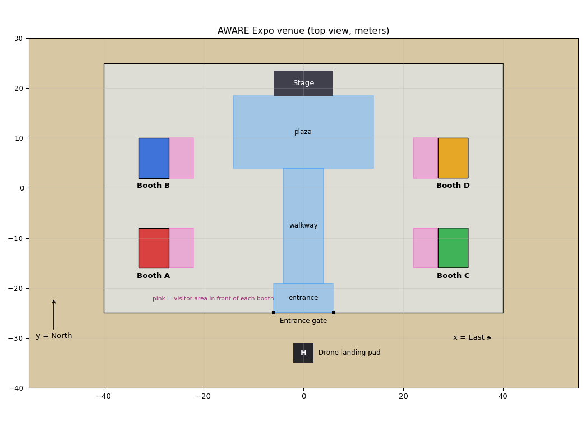
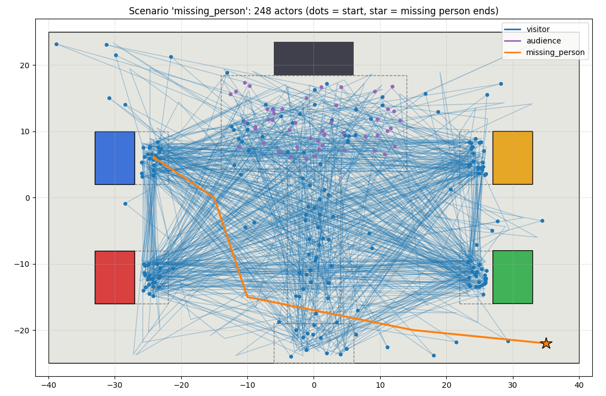
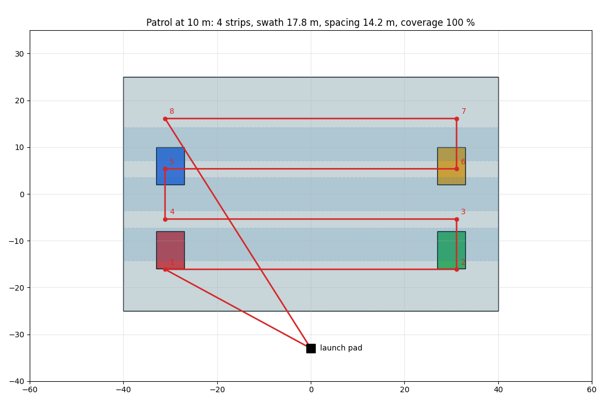

# AWARE simulation: drone over a crowded Expo venue

*Part of [AWARE-Drone-System](../): this folder is the simulated environment.*

A ready-to-run simulation for the **AWARE** project: a drone patrols a simulated
Expo venue in Riyadh with **248 animated people**, and streams its camera so the
AI can search for a **missing person** (red top, white trousers) and the
dashboard can show the results.



**You don't need to know Gazebo, PX4 or ROS to use this.** Follow the steps in
order, copy the commands exactly, and compare what you see with the
"You should see" notes.

---

## Contents

1. [What you need](#1-what-you-need)
2. [Linux basics in 5 minutes](#2-linux-basics-in-5-minutes)
3. [Install (once)](#3-install-once)
4. [Run the simulation](#4-run-the-simulation)
5. [What you are looking at](#5-what-you-are-looking-at)
6. [Changing the simulation](#6-changing-the-simulation)
7. [For the AI and dashboard team](#7-for-the-ai-and-dashboard-team)
8. [When something goes wrong](#8-when-something-goes-wrong)
9. [Words you will meet](#9-words-you-will-meet)
10. [What is in this repository](#10-what-is-in-this-repository)

---

## 1. What you need

| | Requirement |
|---|---|
| Operating system | **Ubuntu 24.04**, installed normally (dual boot is fine). **Not** WSL, **not** a virtual machine: the 3D graphics won't work well there |
| Graphics | An **NVIDIA GPU** is strongly recommended (248 animated people are heavy). Without one, use a smaller crowd (section 6) |
| Disk space | About **25 GB** free |
| Internet | Yes, for the installation (several GB of downloads) |
| Time | 30–90 minutes for the first installation, mostly waiting |

---

## 2. Linux basics in 5 minutes

Everything is done in the **Terminal**, a window where you type commands.

| What | How |
|---|---|
| Open a terminal | Press **`Ctrl` + `Alt` + `T`** |
| Open another tab in it | **`Ctrl` + `Shift` + `T`** |
| **Paste** into the terminal | **`Ctrl` + `Shift` + `V`** (not `Ctrl`+`V`!) |
| Copy from the terminal | Select text, then **`Ctrl` + `Shift` + `C`** |
| **Stop** the running program | **`Ctrl` + `C`** |
| Run a command | Type or paste it, then press **`Enter`** |

A few things that confuse everyone the first time:

- **`sudo`** means "run as administrator". It asks for **your login password**.
  While you type it, **nothing appears on screen** (no dots, no stars). That's
  normal: type it and press `Enter`.
- Lines starting with **`#`** in this guide are **comments**: explanations, not
  commands. Pasting them does nothing harmful.
- **Run one command block at a time** and read what it prints. If you see the
  word `ERROR` or `FAIL`, stop and check [section 8](#8-when-something-goes-wrong).
- `cd folder` means "go into folder"; `ls` means "list what's here".
- The text before your cursor (e.g. `name@laptop:~/AWARE-Drone-System/simulation$`) shows **where you
  are**. `~` means your home folder.

---

## 3. Install (once)

### 3.1 Download this repository

```bash
sudo apt update && sudo apt install -y git
cd ~
git clone https://github.com/Aryam218/AWARE-Drone-System.git
cd AWARE-Drone-System/simulation
```

The simulation lives in the **`simulation/`** folder of the AWARE repository
(the AI pipeline is in `rasid_video_pipeline/` next to it).

> **Important:** the folder path must have **no spaces**. `~/AWARE-Drone-System`
> is perfect. Don't put it in a folder like `~/My Projects/`.

### 3.2 Run the installer

```bash
bash setup/install.sh
```

This installs everything, step by step, and prints a coloured header for each:

| Step | What it does | Time |
|---|---|---|
| 0 | Checks your computer | seconds |
| 1 | ROS 2 Jazzy (robot software framework) | 5–15 min |
| 2 | Downloads PX4 (the drone's autopilot) | 5–10 min |
| 3 | PX4 tools + Gazebo Harmonic (the 3D simulator) | 10–20 min |
| 4 | Builds PX4 | 10–30 min |
| 5 | Python environment for AWARE | 1–2 min |
| 6 | Downloads the 3D people models | 1–3 min |
| 7 | Builds our drone, the outfits and the world | 1 min |
| 8 | Adds short commands to your terminal | seconds |
| 9 | Python environment for the AI (`rasid_video_pipeline`) | 5–15 min |

**You should see** at the end:

```
==== INSTALLATION COMPLETE ====
```

If it stops with `ERROR`, read the message (it says what failed), then see
[section 8](#8-when-something-goes-wrong). Everything is also saved in
`setup/install.log`. Send that file to the team if you need help.

The installer is **safe to run again**: finished steps are skipped.

### 3.3 Restart the computer

Once, after the first installation. (PX4's setup changes your user permissions,
which only take effect after a restart.)

### 3.4 Check the installation

Open a terminal and run:

```bash
cd ~/AWARE-Drone-System/simulation
bash setup/check.sh
```

**You should see** all lines as `[PASS]` (a few `[WARN]` are OK) and:

```
Ready! Continue with 'Running the simulation' in README.md.
```

### 3.5 The AI part (once)

The installer's **step 9** also prepared the AI environment for
`../rasid_video_pipeline` (the search pipeline). One thing it cannot do for you:
the **OpenAI key**. Create a file named `.env` in `rasid_video_pipeline/`:

```bash
cd ~/AWARE-Drone-System/rasid_video_pipeline
nano .env
```

Type this line (with your real key), then save with `Ctrl`+`O`, `Enter`, and exit with `Ctrl`+`X`:

```
OPENAI_API_KEY=sk-...
```

> **Never upload `.env` to GitHub.** This repository is public: anyone could use
> your key, billed to you. (`.env` is already in `.gitignore`.)

Run `bash setup/check.sh` again: the **AI** section should now be all PASS.

---

## 4. Run the simulation

The simulation is made of **several programs that run at the same time**, each
in its own terminal tab:

| # | Program | What it is |
|---|---|---|
| 1 | **World** | The 3D venue, the people and the physics (Gazebo server, no window) |
| 2 | **PX4** | The drone's autopilot. Gives you a `pxh>` prompt to command the drone |
| 3 | **GUI** | The 3D window to watch everything (optional) |
| 4 | **Bridge** | Sends the drone camera to ROS 2, so the AI can read it |
| 5 | **Patrol** | Makes the drone fly over the whole venue by itself |

### 4.1 Everything with one command: `aware_run`

```bash
aware_run
```

It **stops any old run first**, then opens one terminal tab per part, in order,
**waiting until each part is really ready** before starting the next:

| Tab | Part | Waits until |
|---|---|---|
| 1 WORLD | the 3D world (no window) | the world has loaded |
| 2 PX4 | the autopilot, `pxh>` prompt | the drone appears on the pad |
| 4 BRIDGE | camera → ROS 2 | camera images arrive |
| 5 AI | the search, in its own **video window** | ~20 s (loading the models) |
| 6 PATROL | the autonomous flight | **you** (see below) |

**You should see**, after about a minute: the AI window **"AWARE live search"**
showing the live drone camera with **SEARCHING** at the top, and the PATROL tab
ending with:

```
[4/6] TAKEOFF: waiting for YOU. In the PX4 terminal (T2) type:
          commander takeoff
```

**Only now**, click the **2 PX4** tab and type:

```
commander takeoff
```

#### What happens during the flight

| The AI window shows | What it means | What you do |
|---|---|---|
| **SEARCHING** (grey) | Looking for the person in the description | nothing |
| **POSSIBLE MATCH** (orange box) | GPT thinks it found them. **The drone stops and holds position** | press **`c`** (confirm) or **`r`** (reject) in the window |
| **TRACKING CONFIRMED TARGET** (green box) | Following the person in the image; the drone keeps holding over them | nothing |
| **REJECTED / TARGET LOST** (red) | Back to searching; **the patrol resumes** | nothing |

`q` in the AI window quits the search. `Ctrl`+`C` in the PATROL tab = the drone
**returns to the pad and lands**.

#### Options

| Command | Effect |
|---|---|
| `aware_run --gui` | also open the Gazebo 3D window (heavier: skip it on weak GPUs) |
| `aware_run --dashboard` | run the AI through the **dashboard backend** instead of the AI window; start the search from the dashboard with `video_path` = `ros` |
| `aware_run --scenario normal` | rebuild the world first (`normal`, `crowded_booth`, `missing_person`) |
| `aware_run --scenario missing_person --scale 0.5` | ... with half the people (for slower computers) |
| `aware_run --loops 3` | patrol rounds (default 2) |
| `aware_run --auto-takeoff` | take off by itself (no `commander takeoff`) |
| `aware_run --no-ai` | simulation + patrol only |
| `aware_run --help` | list all options |

Options can be combined, e.g. `aware_run --dashboard --gui --loops 3`.

### 4.2 Simulation only (no AI)

```bash
aware_start           # world, PX4, 3D window, bridge (aware_start --no-gui without the window)
aware_patrol          # then fly; type "commander takeoff" in the PX4 tab when asked
```

<details>
<summary>Prefer to start each part yourself? (manual way)</summary>

Open terminal tabs (`Ctrl`+`Shift`+`T`) and run one command in each, **in this
order**, waiting for each to settle:

```bash
~/AWARE-Drone-System/simulation/launch/1_world.sh     # wait until the text stops scrolling
~/AWARE-Drone-System/simulation/launch/2_px4.sh       # wait for the "pxh>" prompt
~/AWARE-Drone-System/simulation/launch/3_gui.sh       # optional 3D window
~/AWARE-Drone-System/simulation/launch/4_bridge.sh    # keeps running quietly
aware_ai && python3 run_live.py                        # the AI window
~/AWARE-Drone-System/simulation/launch/5_patrol.sh    # the flight
```
</details>

### 4.3 See what the drone camera sees

In another tab:

```bash
aware_camera
```

A window opens. If it's empty, select **`/aware/camera/image`** in the drop-down
list at the top.

### 4.4 Stop everything

```bash
aware_stop
```

(Stops Gazebo, PX4, the bridge, the AI and the patrol.)

**Always run this before starting again.** Leftover programs from a previous run
are the #1 cause of blank or frozen windows.

### 4.5 Moving around in the 3D window

| Action | Mouse |
|---|---|
| Zoom | Scroll wheel |
| Move (pan) | Left button + drag |
| Rotate | Middle button + drag (or `Shift` + left drag) |
| Jump to a person or the drone | Right-click its name in the **Entity Tree** (right panel) → **Move to** |

The bottom-right corner shows **RTF** (Real Time Factor): 100 % means the
simulation runs at real speed. Below about 50 %, everything is in slow motion.

---

## 5. What you are looking at

**The venue** (80 × 50 m, centred at the world origin):
4 coloured booths (A red, B blue, C green, D yellow), a stage in the north, the
entrance gate in the south, and the landing pad outside the gate.

**The people (248):**
- **visitors** walk between booths, the stage and open areas, and linger at booths
- **audience** stands in front of the stage
- outfits reflect a Riyadh event: many **white thobes** and **black abayas**,
  plus casual clothes
- **one missing person** wears a **red top and white trousers**. Nobody else
  wears red. They stay at booth B for ~20 s, walk away, and stand alone near the
  **south-east corner** after about 2 minutes



**The drone:** a PX4 "x500" quadcopter with a camera tilted **45°** downward
(so clothes are visible from the side), 1280×960 at 15 frames/s.

**The patrol:** back-and-forth strips that cover the whole floor:



---

## 6. Changing the simulation

All settings are plain text files in **`aware_sim/config/`**. Open them with
any text editor (e.g. `gedit aware_sim/config/patrol.yaml`). After changing a
setting, run the command in the last column, then **restart** the simulation
(`aware_stop`, then `aware_start`).

| I want to change... | File → setting | Then run (in `~/AWARE-Drone-System/simulation/aware_sim`) |
|---|---|---|
| **Scenario** (who is in the crowd) | — | `python3 scripts/generate_world.py --scenario normal` (or `crowded_booth`, `missing_person`) |
| **Number of people** | — | add `--scale 0.5` (half) or `--scale 2` (double) to the command above |
| Patrol **altitude** / speed / loops | `patrol.yaml` → `altitude_m`, `speed_m_s`, `loops` | nothing (no restart needed) |
| Camera **angle** / frame rate | `drone.yaml` → `pitch_deg`, `update_rate` | `python3 scripts/make_drone.py` |
| **Outfits** | `outfits.yaml` | `rm -rf models/aware_people/meshes && python3 scripts/make_outfits.py` then generate the world again |
| Missing person's **route** | `crowd.yaml` → `missing_person: path` | generate the world again |
| Booths, zones, landing pad | `zones.yaml` | generate the world again |

Before generating, you can **preview** a scenario as a picture:

```bash
cd ~/AWARE-Drone-System/simulation/aware_sim
python3 scripts/preview_scenario.py --scenario missing_person   # → docs/scenario_missing_person.png
python3 scripts/patrol_plan.py --preview                        # → docs/patrol_plan.png
```

> **Performance tip:** each **different outfit** costs rendering time for every
> frame. 8 outfits with 248 people runs in real time on an RTX 4060 laptop; 12
> did not. Measure the RTF (section 4.5) after adding outfits.

---

## 7. For the AI and dashboard team

### Topics (ROS 2, domain ID 42)

| Topic | Type | Content |
|---|---|---|
| `/aware/camera/image` | `sensor_msgs/Image` | Drone camera, 1280×960, 15 Hz |
| `/aware/camera/camera_info` | `sensor_msgs/CameraInfo` | Camera intrinsics (focal length, image centre) |
| `/clock` | `rosgraph_msgs/Clock` | Simulation time |
| `/aware/ground_truth` | `std_msgs/String` (JSON) | **Answer key**: true position (x/y and lat/lon), zone, outfit of every person. Start with `launch/ground_truth.sh`. For **scoring** only, never as AI input |
| `/aware/ground_truth/missing_person` | `geometry_msgs/PointStamped` | True position of the missing person |
| `/aware/search_state` | `std_msgs/String` (JSON) | What the AI is doing: `searching`, `candidate`, `confirmed`, `rejected`, `lost`. The patrol **holds position** on `candidate`/`confirmed` and **resumes** on `rejected`/`lost` |

Check that images arrive (in a terminal where `aware_start` is running):

```bash
ros2 topic hz /aware/camera/image      # should show about 15
```

### Connecting the AI search pipeline

The live-camera files (`run_live.py`, `ros_frame_source.py`, `aware_status.py`,
`cloud_track/foundation_model_wrappers/aware_candidates.py`) are part of
`rasid_video_pipeline/`. **[`ai_bridge/README.md`](ai_bridge/README.md)** explains
what each one does and the changes made in the pipeline, in case you need to
re-apply them to another version of the AI code.

**Dashboard backend:** `aware_run --dashboard` starts it with
`uvicorn backend:app --host 0.0.0.0 --port 8000`. A different command can be set
with the environment variable `AWARE_BACKEND_CMD`. Live searches use
`"video_path": "ros"`:

```bash
curl -X POST http://localhost:8000/start -H "Content-Type: application/json" \
  -d '{"video_path": "ros", "description": "a person wearing a red top and white trousers"}'
```

---

### All shortcuts

| Command | What it does |
|---|---|
| `aware_run` | **everything**, one command (section 4.1) |
| `aware_start` | simulation only: world, PX4, 3D window, bridge |
| `aware_stop` (or `aware_kill`) | stop everything |
| `aware_patrol` | fly the patrol |
| `aware_camera` | show the drone camera |
| `aware_check` | check the installation |
| `aware` | go to the simulation folder with its Python active |
| `aware_ai` | go to the AI folder with its Python active (prompt shows `(ai_venv)`) |

---

## 8. When something goes wrong

**First, always:** `aware_stop`, then try again. Most problems are leftovers
from a previous run.

| Symptom | Cause → fix |
|---|---|
| `command not found: aware_start` | The terminal was opened before installation → open a **new** terminal (or run `source ~/.bashrc`) |
| Gazebo window **blank**, shows `N/A` | Old processes still running, or the window opened before the world finished loading → `aware_stop`, then `aware_start` |
| "**ruby3.2 has stopped**" popup | Gazebo crashed (Gazebo's launcher is written in Ruby) → `aware_stop`, start again; if it repeats, check the WORLD tab for errors |
| Everything very **slow** / laptop hot | The integrated graphics is doing the work, or the crowd is too big → `bash setup/check.sh` (Graphics section); plug in the charger; use `--scale 0.5` |
| Patrol prints `Heartbeats ... timed out` again and again | The simulation runs far slower than real time → close the 3D window (`aware_start --no-gui`), use a smaller crowd |
| `commander takeoff` refused: "No connection to the GCS" | Start `aware_patrol` **first**; it counts as the ground station |
| `ros2 topic hz` shows nothing | Tab **4 BRIDGE** isn't running → start `launch/4_bridge.sh` |
| `No module named ...` in Python | The Python environment isn't active → run `aware` first |
| `aware_run` stops with "AI environment missing" | Run `bash setup/install.sh` again (step 9), or use `aware_run --no-ai` |
| AI window says nothing for a long time, never finds the person | The person is only in view on some strips: use `--loops 3`; check the AI tab for `AWARE candidates:` lines |
| The drone doesn't stop at a POSSIBLE MATCH | The PATROL tab must print `listening to the AI on /aware/search_state`; if not, the AI and patrol versions don't match (pull the latest code) |
| `401` / `Incorrect API key` in the AI tab | The `.env` key is wrong or missing (section 3.5) |
| People walking in place, or not appearing | The first start downloads/loads the people models: wait a minute; check `bash setup/check.sh` |

More details: [`docs/TROUBLESHOOTING.md`](docs/TROUBLESHOOTING.md).

---

## 9. Words you will meet

| Word | Meaning |
|---|---|
| **Gazebo** | The 3D simulator: physics, people, cameras. Has a **server** (does the work) and a **GUI** (the window). Closing the window doesn't stop the server |
| **PX4** | Real drone autopilot software, here running on your computer (**SITL** = software in the loop) |
| **ROS 2** | Framework that lets robot programs exchange data through named **topics** |
| **Topic** | A named data channel, e.g. `/aware/camera/image`. Programs publish to it or subscribe to it |
| **Bridge** | Translates Gazebo's messages into ROS 2 topics |
| **MAVSDK** | Python library our patrol script uses to talk to PX4 |
| **venv** | A private Python environment (`aware_venv/`) so our packages don't break the system |
| **Actor** | An animated person in Gazebo |
| **RTF** | Real Time Factor: simulation speed compared with real time (1.0 = 100 %) |
| **`pxh>`** | PX4's command line. Useful: `commander takeoff`, `commander land` |

---

## 10. What is in this repository

```
AWARE-Drone-System/
├── rasid_video_pipeline/        the AI search pipeline
└── simulation/                  ← this folder
    ├── README.md                this guide
    ├── setup/
    │   ├── install.sh           one-time installer
    │   ├── check.sh             "is everything OK?" test
    │   ├── aware_env.sh         terminal shortcuts (aware_run, aware_stop, ...)
    │   └── versions.env         which PX4 version to install
    ├── launch/                  aware_run.sh (everything) + the single steps (1_world ... 5_patrol, stop)
    ├── aware_sim/
    │   ├── config/              ALL settings (venue, crowd, outfits, patrol, drone)
    │   ├── scripts/             generators and tools (world, outfits, drone, patrol, ground truth, recorder)
    │   ├── worlds/              world template (the .sdf is generated)
    │   └── docs/                preview pictures
    ├── ai_bridge/               connect the AI pipeline to the live camera
    └── docs/TROUBLESHOOTING.md
```

Created by the installer inside `simulation/` and **not** stored in git: `PX4-Autopilot/`,
`aware_venv/`, `ai_venv/`, the generated world, outfits and drone models.

### Credits

- [PX4 Autopilot](https://px4.io) (BSD-3), [Gazebo](https://gazebosim.org) (Apache-2.0), [ROS 2](https://ros.org) (Apache-2.0), [MAVSDK](https://mavsdk.mavlink.io) (BSD-3)
- Animated people: [Gazebo Fuel](https://app.gazebosim.org/fuel/models) models
  "actor" (Mingfei) and "actor - relative paths" (OpenRobotics), downloaded at
  install time; outfits are recoloured copies created locally
